# springboot-体育馆使用预约平台 / springboot-Gymnasium_Reservation_Platform

        
        
        
        

> 更多毕设项目可跳转至项目导航栏检索：[毕设项目](http://sysadmin.3vfree.vip)，需要联系博主v：xq-lucky311，q：1047944234. 备注：项目咨询注：由于前端项目太大，仅上传了后端代码，未包含前端代码...

## 项目简介  
基于 SpringBoot + MyBatis Plus + Shiro 的体育馆预约管理系统，集成 MySQL 数据库实现场地预约、订单管理、论坛交互等功能，提供管理员后台与用户前台双端操作界面，支持RBAC权限控制与文件上传服务。

## 特征介绍  
- **分层架构**：标准 MVC 模式构建，包含 controller/service/dao/entity 四层架构。  
- **权限管理**：采用 Shiro 框架实现用户角色鉴权，@LoginUser 注解实现权限拦截。  
- **高效持久化**：MyBatis-Plus 实现零 SQL 单表操作，自定义 MPUtil 工具类增强开发效率。  
- **文件服务**：集成 Commons IO 实现文件上传，配置独立 upload 目录存储场地图片。  
- **工具集成**：内置 Hutool 工具包处理通用功能，FastJSON 实现数据序列化。  
- **多源支持**：配置 MySQL/SQL Server 双数据库连接，支持多类型数据源切换。  

## 代码结构 
```
src/
├── main/
│   ├── java/
│   │   ├── com/
│   │   │   ├── annotation/          # 鉴权注解（LoginUser、IgnoreAuth）
│   │   │   ├── config/              # 全局配置（MybatisPlus、拦截器）
│   │   │   ├── controller/          # 接口层（场地/订单/字典控制器）
│   │   │   ├── dao/                 # 数据访问层（ChangdiDao）
│   │   │   ├── entity/              # 数据模型（POJO + VO/View 模型）
│   │   │   ├── interceptor/         # 权限拦截器（AuthorizationInterceptor）
│   │   │   ├── service/             # 服务层（业务接口与实现类分离）
│   │   │   ├── utils/               # 工具类（文件处理/HTTP请求/MyBatis增强）
│   ├── resources/
│   │   ├── mapper/                  # MyBatis映射文件（XML格式）
│   │   ├── application.yml          # 主配置文件
│   │   ├── static/upload/           # 文件存储目录
```
## 使用说明
**运行环境**  
- 数据库：MySQL 5.7+（默认配置）/ SQL Server 可选
- JDK版本：1.8+
- 推荐浏览器：Google Chrome

**访问地址**  
- 前台系统：http://localhost:8080/tiyuguan/front/index.html  
- 后台管理：http://localhost:8080/tiyuguan/admin/dist/index.html  

**测试账户**  
管理员：admin/admin
普通用户：a1/admin 或 a2/admin


**数据库配置**  
修改 `src/main/resources/config.properties`：  
```properties
jdbc_url=jdbc:mysql://localhost:3306/tiyuguan?useUnicode=true
jdbc_username=root
jdbc_password=123456
```

# 项目实际截图：

## 前台：
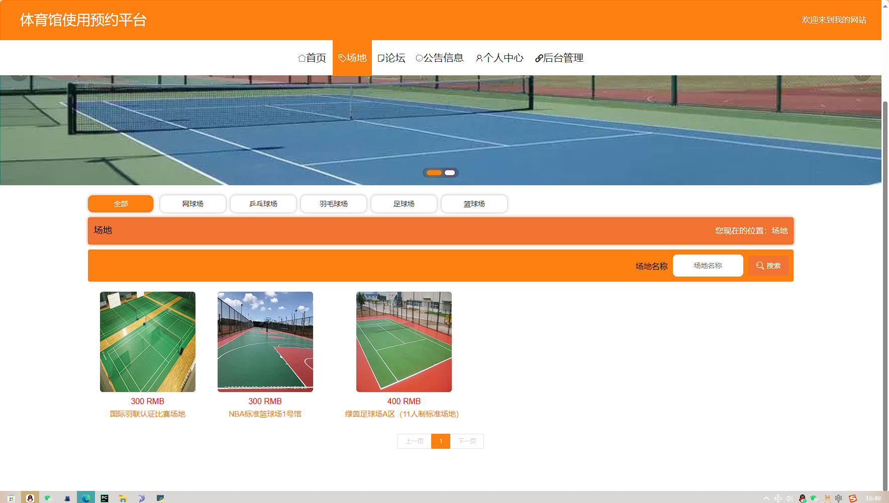
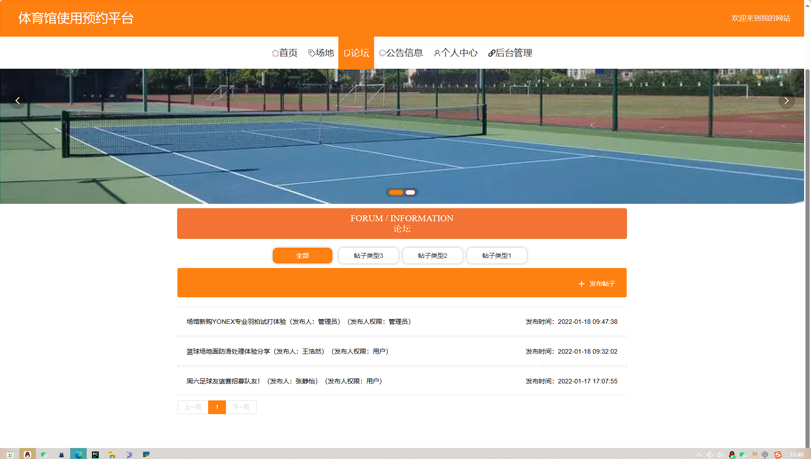
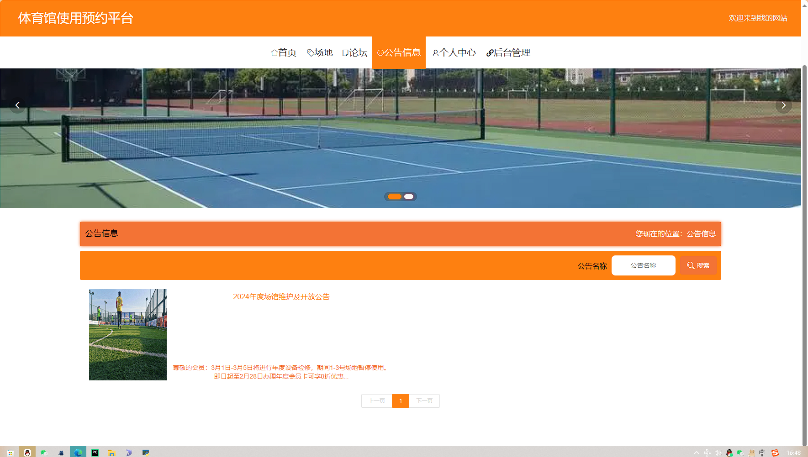

## 后台：
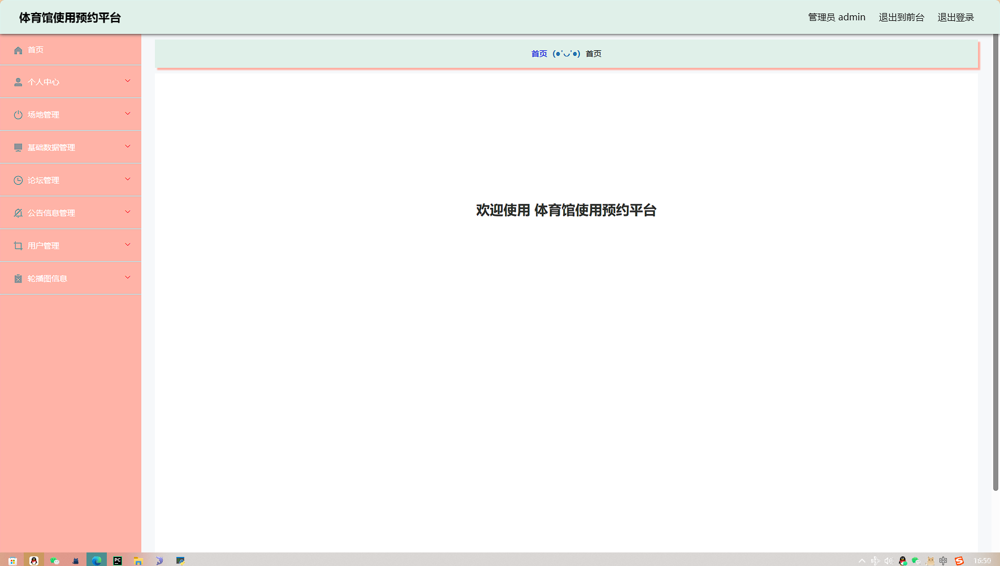
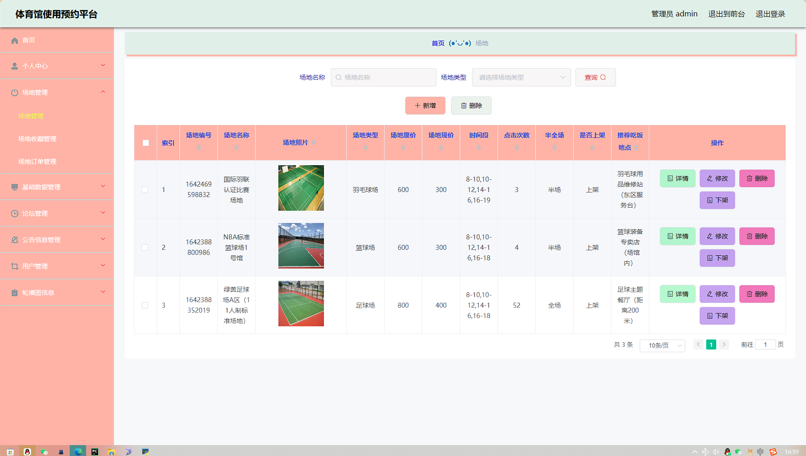
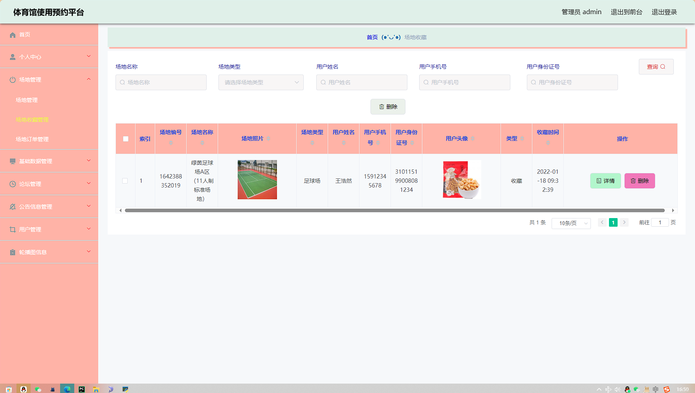
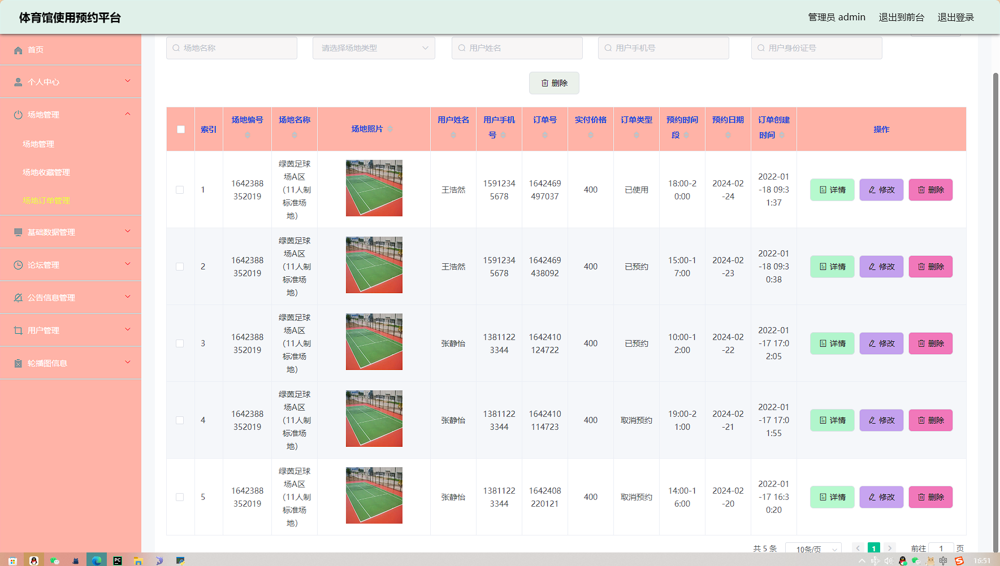
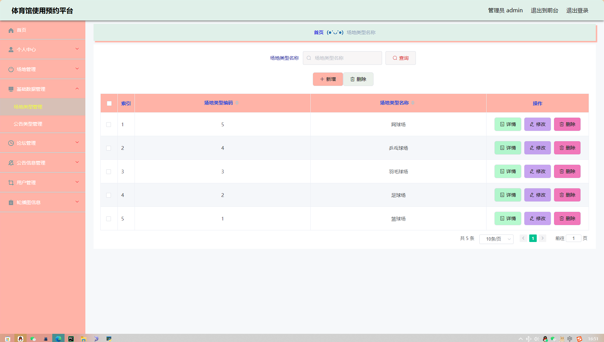
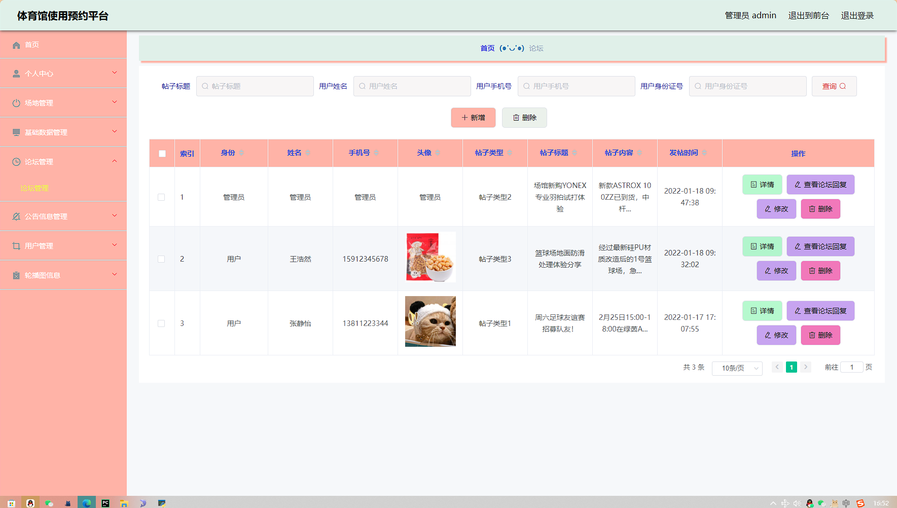
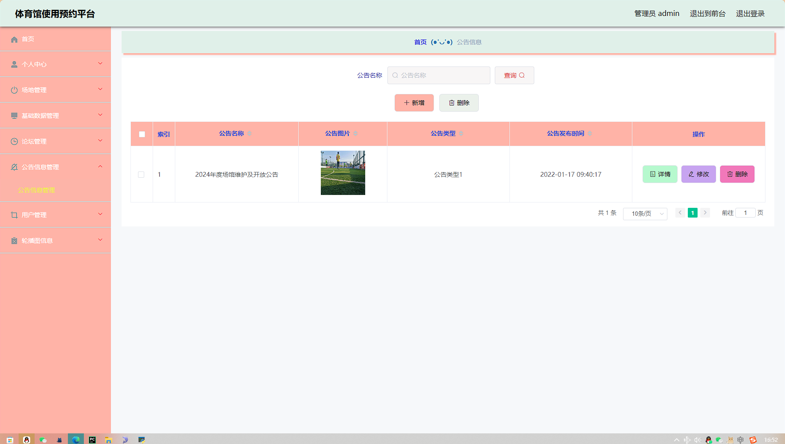
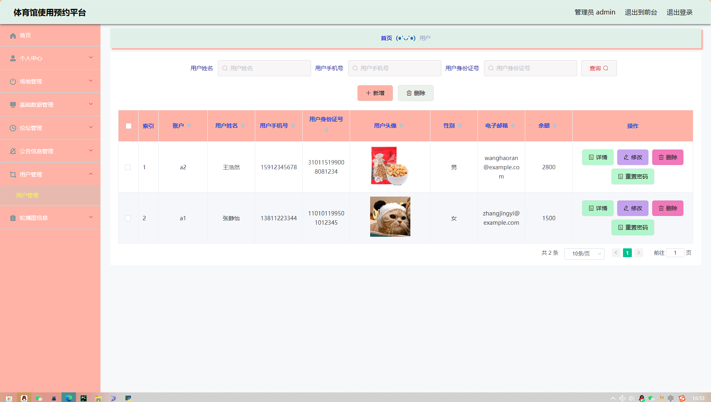

> 等等...

# 精选项目导航 & 快速部署工具
## 项目资源一站直达
- ​**访问项目导航站**：[点击进入](http://sysadmin.3vfree.vip)**快速检索所需项目名称**
- ​**技术栈全覆盖**：Java/SSm/Spring Boot/小程序等主流技术方案
- ​**配套资源**：每个项目均提供部署文档 + 演示视频（附效果截图）

### ▌导航站预览


### ▌工具界面预览


## 捐赠
> 博主将持续更新Java全栈开发项目，包含ssm，springboot，前后端分离系统等项目。
> 此外如果您够宽裕，请博主喝杯咖啡吧！捐赠将用于服务器维护与开源社区建设，感谢您的认可！
> 如需更多Java相关项目毕设3000+，有其他项目需求，sql文件等可联系博主v:xq-lucky311

---
